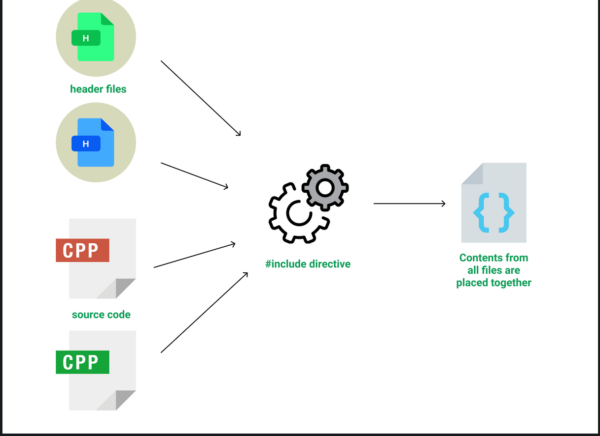

# system programming


## Compliation stages

A compiler converts a C program into an executable. There are four phases for a C program to become an executable: 

* Pre-processing
* Compilation
* Assembly
* Linking

1. Preprocessing
* The preprocessing phase processes the source code before actual compilation begins. 
* It handles directives like #include, #define, and #ifdef by performing text substitution and file inclusion.
* Macros are expanded, conditional compilation directives are evaluated, and comments are removed.

```sh
gcc -E source.c -o source.i
```

2.  Compilation
* In the compilation phase, the preprocessed source code is translated into an intermediate representation, usually assembly code.
* The compiler parses the preprocessed code, generates an Abstract Syntax Tree (AST), optimizes it, and then converts it into assembly 
language specific to the target architecture

```sh
gcc -S source.i -o source.s
```
The output .s file is an assembly language representation of the code. This assembly code is specific to the target machine architecture.

3. Assembly
* During the assembly phase, the assembler converts the assembly code into machine code, generating object code. 
* This phase involves translating each assembly instruction into the corresponding machine instruction (binary code), suitable for the target processor.
* The resulting object file contains machine code and possibly some unresolved references (e.g., function calls to libraries).

```sh
gcc -c source.s -o source.o
```
The .o file contains binary machine code that can be executed by the CPU but is not yet a complete executable program. It may have unresolved symbols, whichwill be addressed in the linking phase.

4. Linking
* The linking phase takes one or more object files and combines them into a single executable or library. 
* This phase resolves references between different object files, links in the necessary libraries.

```sh
gcc source.o -o executable
```
The final output is an executable file, often without an extension (e.g., a.out or a named executable). This binary file is ready to be run on the target system.





Normal compilation
```sh
gcc –g –o hello hello.c
```
* -g include debugging information
* -o option specifies the name of the output file. In this case, it tells GCC to produce an executable file named hello.
If this option is not used, GCC will generate an output file named a.out by default.


To get intermediate files
```sh
$ gcc -Wall -save-temps hello.c -o hello
```
* -save-temps: This option tells the compiler to save the intermediate files generated during the compilation process.
* -Wall: This option enables all the commonly used warning messages during compilation.

## GCC Internals

The GNU Compiler Collection (GCC) comprises a number of compilers for different programming languages. The main GCC executable gcc processes source files written in C, C++, Objective-C, ObjectiveC++, Java, Fortran, or Ada and produces an assembly file for each source file. 

It is a driver program that invokes the appropriate compilation programs depending on the language of the source file. 

For a C source file they are the preprocessor and compiler cc1, the assembler as, and the linker collect2. The first and the third programs come with a GCC distribution; the assembler is a part of the GNU binutils package. Conversion to SSA: In SSA, each variable is assigned only once, but can be used multiple times. When a variable is reassigned, a new version of the variable is created

Each compiler includes three components: a front end, a middle end, and a back end.

* Front End: Each programming language has its own front end that generates an Abstract Syntax Tree (AST)
Each language's front end generates an AST, which represents the structure of the source code

* Middle End: Unifies the different ASTs into a generic form, then converts it into GIMPLE and Static Single Assignment (SSA) representations for optimization
The various language-specific ASTs are converted into a unified form called generic.
    * The generic representation is converted into GIMPLE, a simplified form
        * Each expression has no more than three operands
        * Control flow constructs are simplified to conditional statements and goto operators.
        * Function call arguments are only variables.

    * GIMPLE is designed for ease of optimization.

    * Conversion to SSA: In SSA, each variable is assigned only once, but can be used multiple times. When a variable is reassigned, a new version of the variable is created

    * SSA form is used for performing various optimizations. GCC performs over 20 different optimizations on SSA trees
    * Post-Optimization: After optimizations, the SSA form is converted back to GIMPLE for further processing.

* Backend:RTL plays a pivotal role in GCC's backend by serving as an intermediate representation that allows the compiler to perform detailed optimizations and generate machine-specific code 

## Mapping with phases of compilation

* Lexical Analyzer → Tokens
    * The source code is read and converted into tokens (identifiers, keywords, operators, etc.). This phase is handled by the front end of the compiler.

* Syntax Analyzer → AST
    * The tokens are parsed according to the grammar of the programming language, and an Abstract Syntax Tree (AST) is generated. This tree represents the syntactical structure of the program.

* Semantic Analyzer → Annotated AST
    * The AST is analyzed for semantic correctness (e.g., type checking, variable scope resolution). The tree may be annotated with additional semantic information.

* Intermediate Code Generator → GIMPLE
    * The AST is lowered into a simpler, language-independent intermediate representation called GIMPLE, which is easier to optimize.

* Code Optimizer → GIMPLE/SSA/RTL
    * This might involve transforming the GIMPLE representation into Static Single Assignment (SSA) form, Various optimization passes are applied to the intermediate representations.

* Code Generator → RTL → Assembly
    * The optimized intermediate representation (often RTL) is converted into machine-specific assembly code.


[gcc internals-1](https://bitboom.github.io/2018-10-22/an-overview-of-gcc)

[gcc internals-2](https://gcc-newbies-guide.readthedocs.io/en/latest/diving-into-gcc-internals.html)

[RTL](https://www.cse.iitb.ac.in/~uday/courses/cs715-09/gcc-rtl.pdf)


